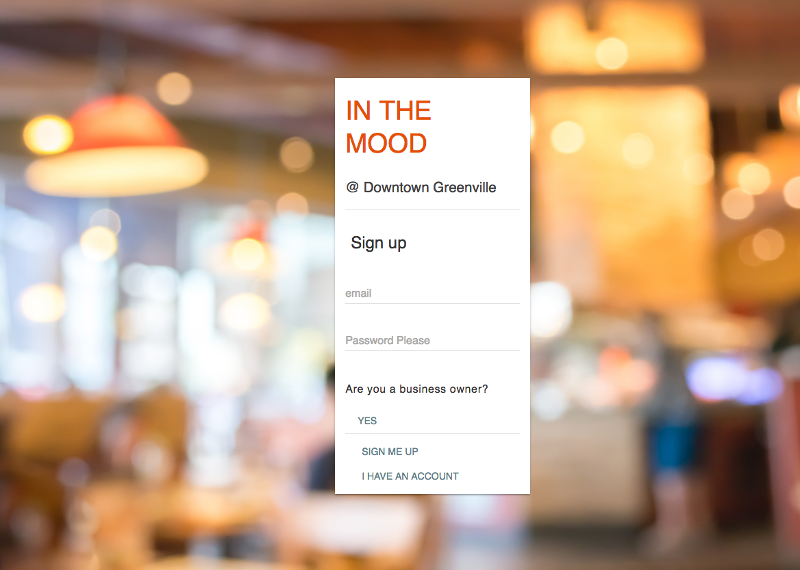
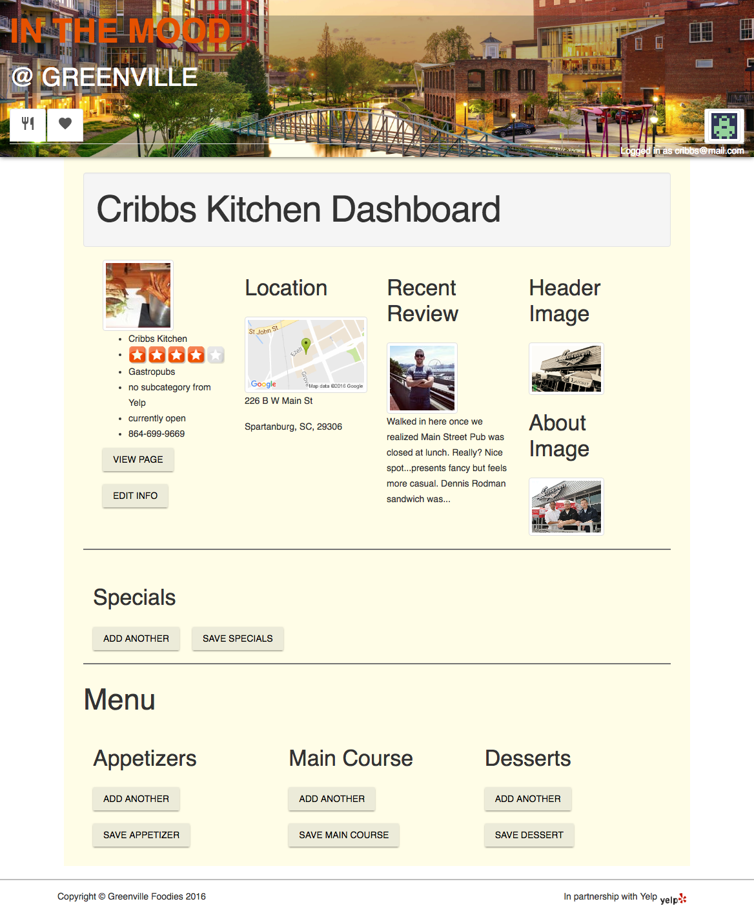
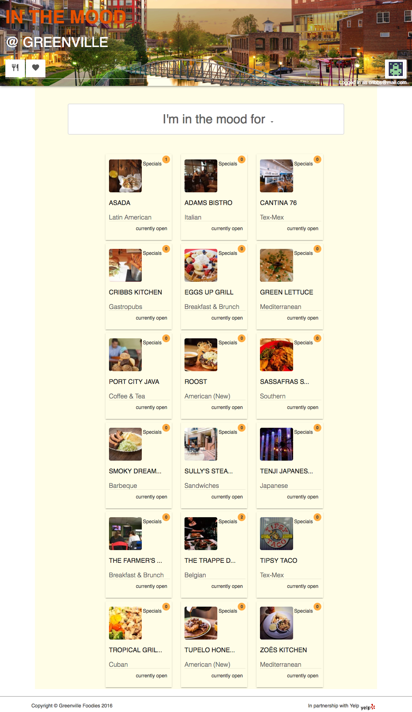
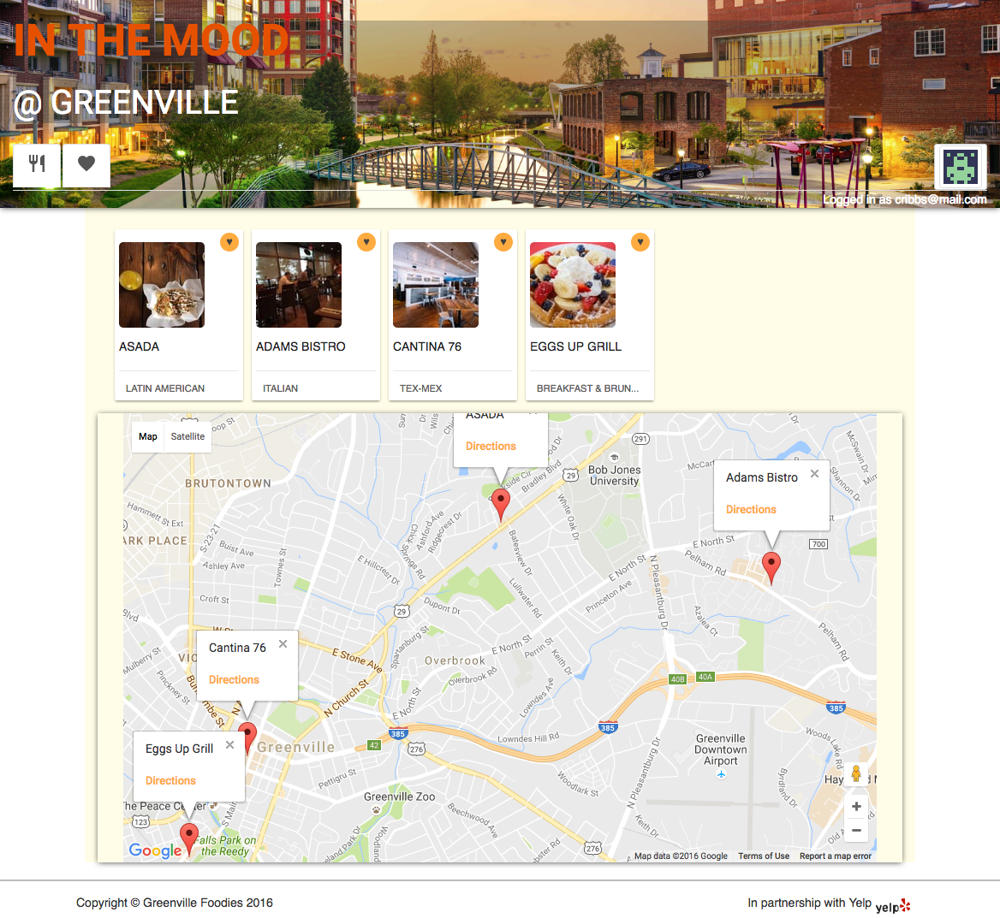
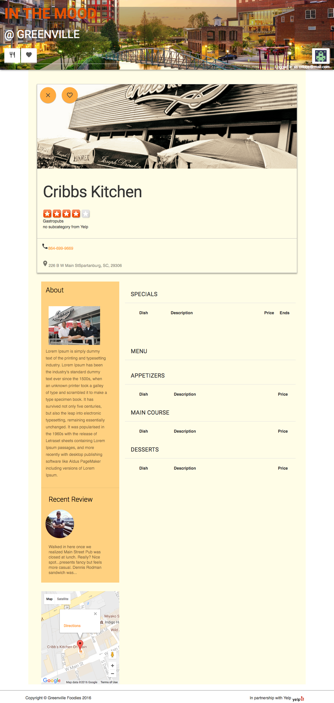

# IN THE MOOD
### @ Greenville

#### By Matias Mariani

---

Check out IN THE MOOD, **[HERE!](https://matiasironyard.github.io/Final-Project-Main-Street/)**.

What is it?

* A website dedicated to the great restaurants of Greenville, SC.
* A platform that lets restaurant owners create a beautiful webpage in a matter of minutes by simply using their business phone number!
* All relevant information in retrieved from Yelp and is used to quickly set up their website.
* Visitors can quickly navigate the site and find what their looking by simply clicking "I'm in the mood for.." and selecting from all the categories available in the area. Users can also save their favorite restaurants, get a detail view of the location using the integrated Google Maps API and get directions.

### Tech used....

####Written in HTML-5, Javascript, CSS with:

* React
* Boostrap
* Backbone
* JQuery
* NPM.js
* SCSS

---

##### Other teched used:

* **[Yelp API V.2] (https://www.yelp.com/developers/documentation/v2/search_api)**
* **[Google Maps API] (https://developers.google.com/maps/)**
* **[React-Google-Maps] (https://www.npmjs.com/package/react-google-maps)**
* **[Heroku] (https://www.heroku.com)**
* **[Express-http-Proxy] (https://www.npmjs.com/package/express-http-proxy)**
* **[Material Design Lite] (https://getmdl.io/index.html)**
* **[Google Fonts] (https://fonts.google.com/)**

---

##Screenshots

